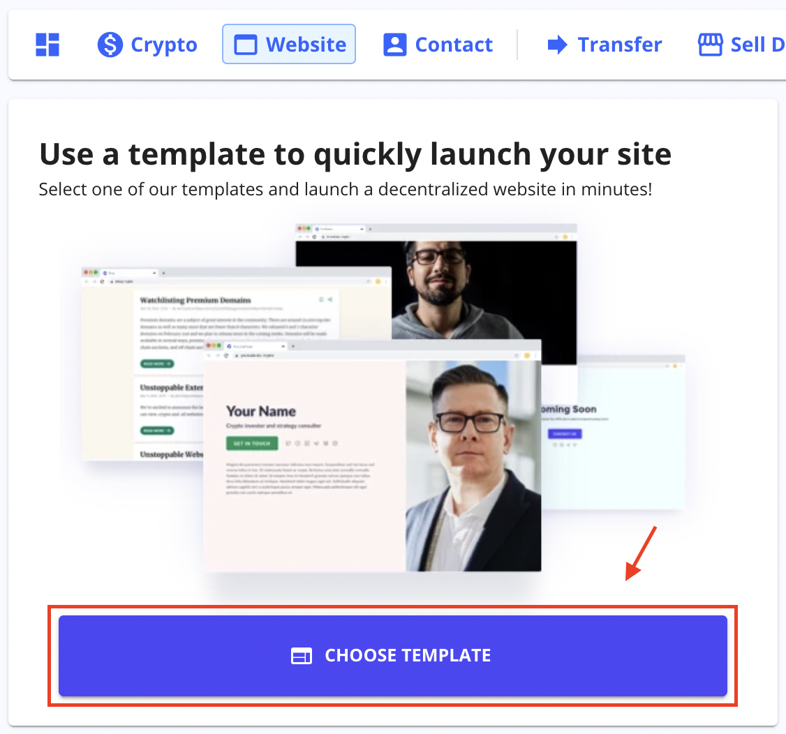
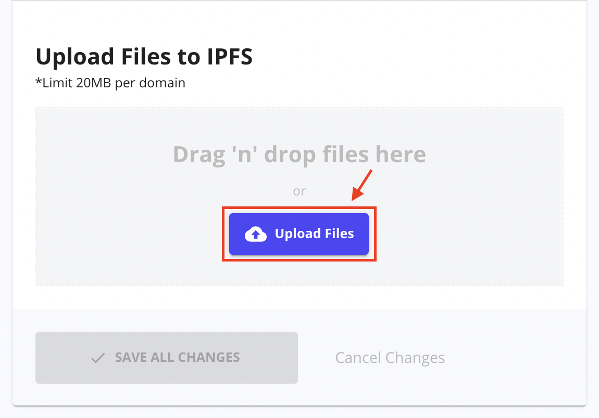

# Connect a D-Website to Your Domain

UD provides three options for connecting your decentralized website to your domain:

1. Select an UD website template to customize and deploy directly to IPFS
2. Upload your own website files to our IPFS uploader \(limited to 20MB per domain\)
3. Build a customized website yourself and attach your IPFS hash to your domain

## Configuring Your D-Website

Hosting a d-website on IPFS is slightly different from hosting it on a centralized web server, and you will need to ensure that your website is properly configured for the IPFS network. Important rules to follow:

* All of the content for your website must be contained in one build folder, with an index.html file.
* All links within your files should be relative links.

These rules apply if you are building and uploading your own customized website using [Option 2 ](connecting-your-d-website-to-your-domain.md#option-2-upload-your-own-website-files-to-our-ipfs-uploader)or [Option 3](connecting-your-d-website-to-your-domain.md#option-3-build-a-customized-website-yourself-and-attach-your-ipfs-hash-to-your-domain) below.

## Option 1: Select a UD website template to customize and deploy directly to IPFS

* Select **Manage** next to the domain you want to use.
* Select the **Website** tab
* Select the **Choose A Template**

* Select the **Page Type** \(i.e. landing page, blog, personal site, etc.\)

* **Edit the Content** to customize your website \(add your name, photo, content, etc.\) and **Publish to IPFS** when finished

## **Option 2: Upload your own website files to our IPFS Uploader**

* Go to **My Domains**
* Select **Manage** next to the domain you want to use
* Select the **Website** tab

* Upload your files to the **IPFS Uploader** and **Save Changes**


For websites that exceed the 20MB file limit, we recommend using a dedicated pinning service, such as [Pinata](https://pinata.cloud/) or [Temporal](https://temporal.cloud/).


## Option 3: Build a customized website yourself and attach your IPFS hash to your domain

* Select **My Domains**
* Select **Manage** next to the domain you want to use
* Select the **Website** tab

* Add your **IPFS hash** to the respective field

