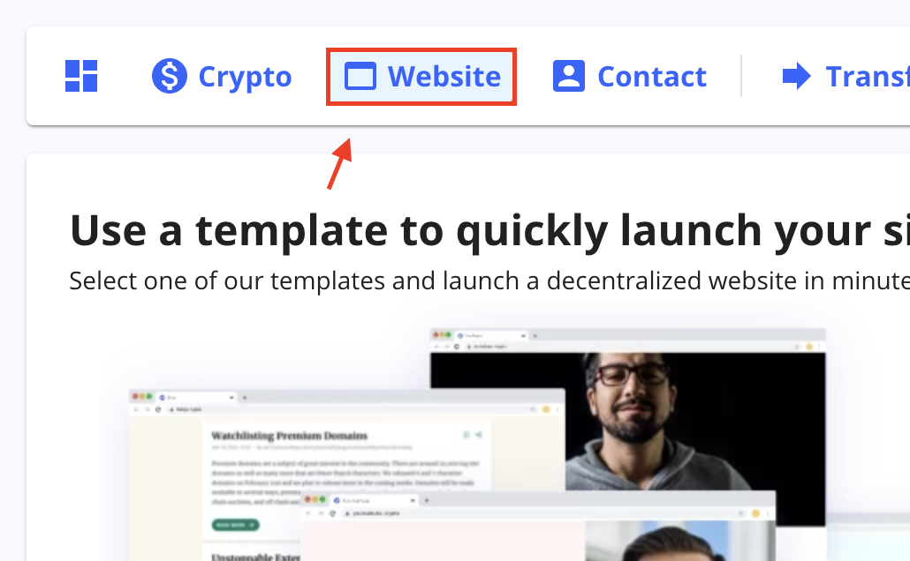

# Resolve D-Website in a Browser

It will take some time for the IPFS website transaction to resolve on the blockchain after the transaction is signed with the user’s wallet. After the domain records are updated, the decentralized website will resolve in certain browsers and browser extensions.

## Compatible Browsers and Extensions

The following is a list of compatible browsers and extensions for decentralized websites:

* [Opera](https://unstoppabledomains.com/opera) for desktop and mobile \(supports .crypto\)
* [Brave](https://unstoppabledomains.com/brave_pa) for desktop and mobile \(supports .crypto\)
* [Google Chrome Extension](https://chrome.google.com/webstore/detail/unstoppable-extension/beelkklmblgdljamcmoffgfbdddfpnnl?hl=en-US&authuser=0) \(supports all Unstoppable Top Level Domains\)
* [Firefox Extension](https://addons.mozilla.org/en-US/firefox/addon/unstoppable-extension/) \(supports all Unstoppable Top Level Domains\)
* [Unstoppable Browser](https://unstoppabledomains.com/browser) \(supports .crypto and .zil\)

## Add a Custom DNS to Your Browser

Once you have configured your browser according to this guide, you will be able to access .crypto Unstoppable domains in two different ways:

1. \`[http://domainname.crypto\`](http://domainname.crypto%60/) note **http** not https
2. **domainname.crypto/** the **forward slash** is to override your browser's search engine searching for the domain.


If you have the Unstoppable extension in your browser you will need to disable it to switch to DNS over https \(which retains the domain name in the browser\).


The following table provides the configuration options for different browsers in order to view d-websites.

<table>
  <thead>
    <tr>
      <th style="text-align:left">Browser Type</th>
      <th style="text-align:left">Configuration Settings</th>
    </tr>
  </thead>
  <tbody>
    <tr>
      <td style="text-align:left">Edge</td>
      <td style="text-align:left">Browser Settings Menu &gt; Privacy, search, and services &gt; Security
        section and set Custom URL as <a href="https://resolver.unstoppable.io/dns-query">https://resolver.unstoppable.io/dns-query</a>
      </td>
    </tr>
    <tr>
      <td style="text-align:left">Chrome</td>
      <td style="text-align:left">Browser Settings Menu &gt; Privacy and security &gt; Security &gt; Advanced
        section and set Custom URL as <a href="https://resolver.unstoppable.io/dns-query">https://resolver.unstoppable.io/dns-query</a> 
      </td>
    </tr>
    <tr>
      <td style="text-align:left">Firefox</td>
      <td style="text-align:left">Browser Settings Menu &gt; Options &gt; General Tab &gt; Network Settings
        &gt; Settings section and set Custom URL as <a href="https://resolver.unstoppable.io/dns-query">https://resolver.unstoppable.io/dns-query</a> and
        click OK.</td>
    </tr>
    <tr>
      <td style="text-align:left">Brave</td>
      <td style="text-align:left">
        
NOTE: Brave has <a href="https://support.unstoppabledomains.com/support/solutions/articles/48001188302-ultimate-user-guide#surfdweb">native support</a> for
          desktop and Android (iOS to follow). Follow these steps for other devices:

        

        
Browser Settings Menu &gt; Additional settings &gt; Privacy and security
          &gt; Security &gt; Advanced section and set Custom URL as <a href="https://resolver.unstoppable.io/dns-query">https://resolver.unstoppable.io/dns-query</a>
        

      </td>
    </tr>
    <tr>
      <td style="text-align:left">Opera</td>
      <td style="text-align:left">
        

        
Opera Browser has <a href="https://unstoppabledomains.com/blog/opera-helloweb3">native support</a> for
          resolving .crypto domains across all platforms.

      </td>
    </tr>
    <tr>
      <td style="text-align:left">Android Phones</td>
      <td style="text-align:left">For Android, follow the details for your browser as covered in the guidelines
        above.</td>
    </tr>
    <tr>
      <td style="text-align:left">iPhones &amp; Safari</td>
      <td style="text-align:left">Download this <a href="https://gist.github.com/mvwi/52b1f51786e95e791bc44c00ddeb4d85/raw/9315fc9172a7b2dd91dd849a8cb3bbe3295362a9/cloudflare-https.mobileconfig">DNS profile</a>.
        Install the profile in Safari under Settings &gt; General &gt; Profile.</td>
    </tr>
  </tbody>
</table>


This guide is for resolving .crypto domains in the browser. To resolve .zil or other top level domains, you will either need the [browser extension](https://unstoppabledomains.com/extension) or the [Unstoppable Browser](https://unstoppabledomains.com/browser).


## Resolve Using a Gateway URL

You can also resolve a decentralized website using a gateway URL, such as the ones provided by [Blockscan](http://blockscan.com/) or [Pinata](https://docs.pinata.cloud/gateways/dedicated-gateways). 

IPFS gateways provide workarounds for applications that do not yet support IPFS natively, which allows those browsers and tools to access IPFS content. See the resource guide on [IPFS Gateways](https://docs.ipfs.io/concepts/ipfs-gateway/#overview) for more information.

## **Resolve a Traditional DNS record with an Unstoppable Domain**

In order to set up a redirection to a traditional domain, you will need to do a redirection via index.html on your blockchain domain so users are sent to a traditional domain. 

* On your computer, open a text editing software \(for example: Notepad for Windows or TextEdit for Mac\) and paste the following code.

<table>
  <thead>
    <tr>
      <th style="text-align:left">
        
&lt;!DOCTYPE html&gt;

        
&lt;html&gt;

        
&lt;head&gt;

        
&lt;title&gt;HTML Meta Tag&lt;/title&gt;

        
&lt;meta http-equiv = &quot;refresh&quot; content = &quot;1; url = YOUR
          WEBSITE URL HERE&quot; /&gt;

        
&lt;/head&gt;

        
&lt;body&gt;

        
&lt;p&gt;YOUR WEBSITE DESCRIPTION HERE &lt;/p&gt;

        
&lt;/body&gt;

        
&lt;/html&gt;

      </th>
    </tr>
  </thead>
  <tbody></tbody>
</table>

* Replace YOUR WEBSITE HERE with your URL and YOUR WEBSITE DESCRIPTION HERE with a short description of your website and save the file as **index.html** \(do not use any other name\).
* Open index.html from your hard drive to see if everything is working before proceeding. Right-click the file and select "**Open with**" followed by your browser of choice. 

* Go to the **My Domains** section of our website, click **Manage** over the domain you wish to redirect, and click the **Website** tab.

* Scroll down to **Upload Files to IPFS** and click **Upload**.

* **Browse** for the index.html file located on your computer and Click confirm.
* Scroll down further and click **Confirm Changes**.

