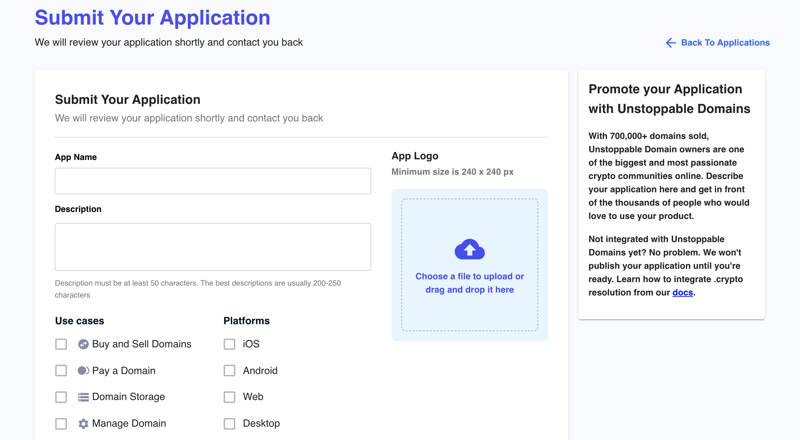
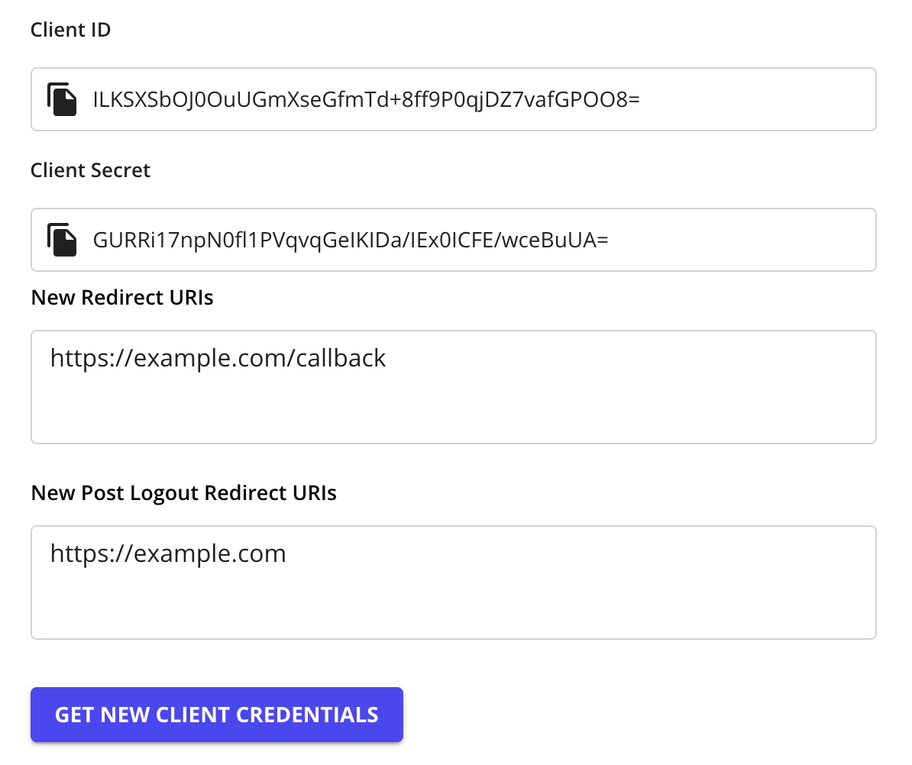
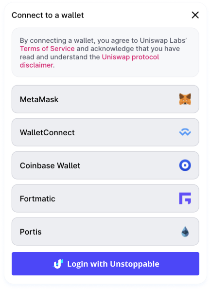
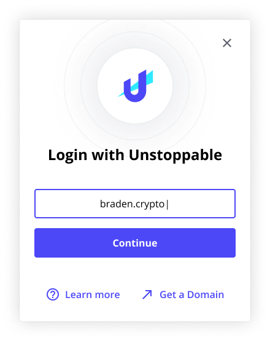

# Developer Integration


The [UAuth Demo Application](https://uauth-demo.uc.r.appspot.com) is deployed for developer use along with a [single page sample application](https://github.com/unstoppabledomains/uauth/tree/main/examples/spa/src) to model the flow.


Integrating Login with Unstoppable is a four step process. Applications can use Unstoppable Domain’s [UAuth Library](https://github.com/unstoppabledomains/uauth) to simplify the integration.

## Step 1: Register Your Application

* **Go** to the Unstoppable Domains [Application Submission](https://unstoppabledomains.com/app-submission) page.
* **Complete** all fields: App Name, Description (at least 50 characters), App Logo, Website link, and any applicable checkboxes (e.g., use cases, platforms, extensions).
* **Submit** the application for review.



## Step 2: Configure the Application

* **Visit** the [App Dashboard](https://unstoppabledomains.com/app-dashboard) once your application has been created. (To see the status of the application, check your email or refresh the Application Dashboard.)


You can begin App development right away while waiting on application approval. The application approval only relates to your application appearing on the UD global application screen and is not a blocker to integration.


* Click the **Edit** button next to the application you would like to configure for Login with Unstoppable.

.png>)

* Scroll down and click the **Get New Client Credentials** button.


* **Enter the redirect URIs** on the Client Credentials Screen. Save** the client id and secret key** for later reference ([Step 4 below](developer-integration.md#step-4-modify-the-code-base-of-uauth-library)).


Enter each additional redirect URI on a separate line, if applicable. You will be able to edit the redirect URIs on this screen but not the client id and secret key.





The redirect URls entered on this page must be an exact match to the redirect URIs used in the UAuth Library modification below ([See Step 4](developer-integration.md#step-4-modify-the-code-base-of-uauth-library)).


* **Save the changes** by clicking the Get New Client Credentials button again.

## Step 3: Add the Login with Unstoppable Button to Your Application's UI

Login with Unstoppable button status and states can be found in the table below:

| **Status** | **Small**                                   | **Large**                                     |
| ---------- | ------------------------------------------- | --------------------------------------------- |
| Default    |  |  |
| Hover      |    |    |
| Pressed    |  |  |

### Example: User View of Login with Unstoppable Feature



### Example: User Enters Unstoppable Domain Address to Login to Application

When a user clicks the Login with Unstoppable button, a modal is displayed which will allow that user to begin the authorization process.



## Step 4: Configure the Application to Receive the Authorization Tokens and MetaData

* [ ] Modify the [Uauth class](https://github.com/unstoppabledomains/uauth/blob/c01776f3aedf599dfc76b20ea86750890754010e/examples/spa/src/index.tsx#L14) as follows:
  * Add the [client id and secret key](https://github.com/unstoppabledomains/uauth/blob/c01776f3aedf599dfc76b20ea86750890754010e/examples/spa/src/index.tsx#L16).&#x20;
  * Add all the [elements](https://github.com/unstoppabledomains/uauth/blob/c01776f3aedf599dfc76b20ea86750890754010e/examples/spa/src/index.tsx#L20) you will be requesting from the user.
  * Link the [​​url](https://github.com/unstoppabledomains/uauth/blob/c01776f3aedf599dfc76b20ea86750890754010e/examples/spa/src/index.tsx#L23) that the auth server will redirect back to after every authorization attempt.
  * Link the [url](https://github.com/unstoppabledomains/uauth/blob/c01776f3aedf599dfc76b20ea86750890754010e/examples/spa/src/index.tsx#L26) that the auth server will redirect back to after logging out.
* [ ] Modify the [Login function](https://github.com/unstoppabledomains/uauth/blob/c01776f3aedf599dfc76b20ea86750890754010e/examples/spa/src/index.tsx#L55) that will be triggered from the “Login with Unstoppable” button from the application UI. This function will also handle any login errors.
* [ ] Modify the [Callback function](https://github.com/unstoppabledomains/uauth/blob/c01776f3aedf599dfc76b20ea86750890754010e/examples/spa/src/index.tsx#L77) to exchange the authorization code for access and id tokens and to handle any failures from exchanging the authorization code for the token.
* [ ] Modify the [Logout function](https://github.com/unstoppabledomains/uauth/blob/c01776f3aedf599dfc76b20ea86750890754010e/examples/spa/src/index.tsx#L118) to handle logging out and redirection to the application home page.



```
const uauth = new UAuth({
  // These can be copied from the bottom of your app's configuration page on unstoppabledomains.com.
  clientID: process.env.REACT_APP_CLIENT_ID,
  clientSecret: process.env.REACT_APP_CLIENT_SECRET,

  // These are the scopes your app is requesting from the ud server.
  scope: 'openid email wallet example',

  // This is the url that the auth server will redirect back to after every authorization attempt.
  redirectUri: 'http://localhost:5000/callback',

  // This is the url that the auth server will redirect back to after logging out.
  postLogoutRedirectUri: 'http://localhost:5000',
})
```



```
const Login: React.FC<RouteProps> = props => {
  const [errorMessage, setErrorMessage] = useState<string | null>(
    new URLSearchParams(props.location?.search || '').get('error'),
  )

  const handleLoginButtonClick: React.MouseEventHandler<HTMLButtonElement> =
    e => {
      setErrorMessage(null)
      uauth.login().catch(error => {
        console.error('login error:', error)
        setErrorMessage('User failed to login.')
      })
    }

  return (
    <>
      {errorMessage && <div>{errorMessage}</div>}
      <button onClick={handleLoginButtonClick}>Login with Unstoppable</button>
    </>
  )
}
```



```
const Callback: React.FC<RouteProps> = props => {
  const [redirectTo, setRedirectTo] = useState<string>()

  useEffect(() => {
    // Try to exchange authorization code for access and id tokens.
    uauth
      .loginCallback()
      // Successfully logged and cached user in `window.localStorage`
      .then(response => {
        console.log('loginCallback ->', response)
        setRedirectTo('/profile')
      })
      // Failed to exchange authorization code for token.
      .catch(error => {
        console.error('callback error:', error)
        setRedirectTo('/login?error=' + error.message)
      })
  }, [])

  if (redirectTo) {
    return <Redirect to={redirectTo} />
  }

  return <>Loading...</>
}

const Profile: React.FC<RouteProps> = () => {
  const [user, setUser] = useState<any>()
  const [loading, setLoading] = useState(false)
  const [redirectTo, setRedirectTo] = useState<string>()

  useEffect(() => {
    uauth
      .user()
      .then(setUser)
      .catch(error => {
        console.error('profile error:', error)
        setRedirectTo('/login?error=' + error.message)
      })
  }, [])
```



```
const handleLogoutButtonClick: React.MouseEventHandler<HTMLButtonElement> =
    e => {
      console.log('logging out!')
      setLoading(true)
      uauth
        .logout({
          beforeRedirect(options: any, url: string) {
            // alert(url)
          },
        })
        .catch(error => {
          console.error('profile error:', error)
          setLoading(false)
        })
    }

  if (redirectTo) {
    return <Redirect to={redirectTo} />
  }

  if (!user || loading) {
    return <>Loading...</>
  }

  return (
    <>
      <pre>{JSON.stringify(user, null, 2)}</pre>
      <button onClick={handleLogoutButtonClick}>Logout</button>
    </>
  )
}
```



### Example: User Consent Screen for Login with Unstoppable

During login, the user will see the resolved address and the information being requested by the application.


## UI Recommendations

Once a user has successfully authenticated, the application should display that user’s domain name in the application’s UI to confirm the authorization was successful (i.e. show the user’s domain instead of the address).

### Example 1


### Example 2


## Limitations & Resources

Login with Unstoppable has the following limitations:

* Does not support .zil domains
* Pre-made components are only available initially in React. The modal is written in react, which has a larger library size.

For assistance with this feature, please join our [Discord channel](https://discord.gg/b6ZVxSZ9Hn) for real-time support from UD and the community.
