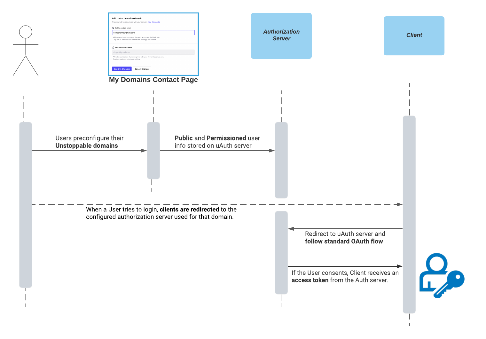

# High Level Overview

The Login with Unstoppable feature allows the owner of an Unstoppable domain to share their contact information with the dApp without the need for a dApp team to host/maintain a CRM database of all their users. With most sign-in methods, it is difficult to track who visits your dApp and to contact users of your dApp because you may not have email or other contact methods. And, if the user is not in your Discord or following your Twitter, then users could miss important announcements or updates.

Login with Unstoppable gives users the option to share their contact information using a simple wallet signature based on the OpenID Connect \(OIDC\) authorization protocol. Users will have **public** and **permissioned** information they can share such as email addresses, social profiles, community memberships, etc. This information sharing is 100% opt-in and wholly controlled by the user, which puts users back in control of their data \(BYOD, bring your own data\) through a decentralized authorization process that is secured with a simple web3 wallet signature. 

## Benefits for dApps

1. Communicate with community members directly via permissioned access to their email addresses.
2. No need to host a database of user contact information because dApps can ask for permissions to access personal data such as email addresses and contact information. 
3. dApps will be web3 compliant.

## Benefits for Users 

1. Users can choose to share what information \(if any\) they want to share with the dApp. The information sharing is 100% opt-in and wholly controlled by the user.
2. No need to remember multiple unique usernames and passwords. Login to dApps using Login with Unstoppable.
3. Users control login credentials \(private key\) not a corporation. 

## Limitations

* Does not support .zil domains
* Does not support ENS domains
* The modal is written in react, which has a larger library size

